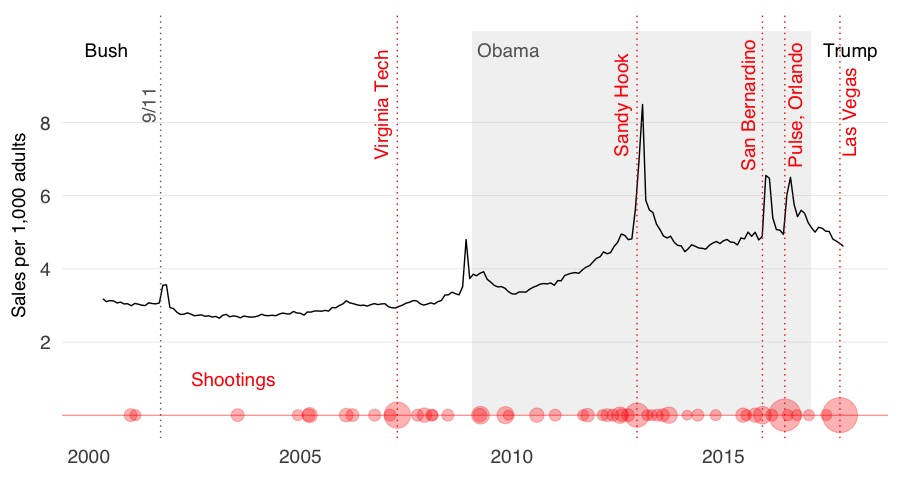

```{r setup, include=FALSE}
knitr::opts_chunk$set(out.width="900px", dpi=300)
```

Data and [R](https://www.r-project.org/) code for the analysis supporting this [November 3, 2017 BuzzFeed News post](https://www.buzzfeed.com/peteraldhous/gun-sales-after-vegas-shooting) on estimated gun sales, from 2000 to the weeks immediately following the [Las Vegas mass shooting](https://www.buzzfeed.com/buzzfeednews/live-updates-two-people-are-dead-as-police-investigate) on October 2, 2017. Supporting files are in [this GitHub repository](https://github.com/BuzzFeedNews/2017-11-gun-sales-estimates).

## Data and methods

The analysis relies on estimating gun sales from background checks recorded in the FBI's [National Instant Criminal Background Check System](https://www.fbi.gov/services/cjis/nics), parsed from the [PDF](https://www.fbi.gov/file-repository/nics_firearm_checks_-_month_year_by_state_type.pdf/view) updated monthly by the FBI to a CSV file using the code in [this BuzzFeed News GitHub repository](https://github.com/BuzzFeedNews/nics-firearm-background-checks).

As in this [previous analysis](https://github.com/NYTimes/gunsales), performed for [this](https://www.nytimes.com/interactive/2015/12/10/us/gun-sales-terrorism-obama-restrictions.html) New York Times article, we estimated sales from background checks using a method developed by Jurgen Brauer of Augusta University in Georgia and the consultancy [Small Arms Analytics & Forecasting](http://smallarmsanalytics.com/), originally developed for [this report](http://www.smallarmssurvey.org/fileadmin/docs/F-Working-papers/SAS-WP14-US-Firearms-Industry.pdf). Based on informal surveys conducted by Brauer, the method assumes that each dealer handgun or long gun permit check results, on average, in 1.1 guns being sold, and each "multiple" check results in the sale of two guns. Each private sale check is assumed to result in the sale of a single gun. Other checks, including those conducted routinely to renew gun permits and those run when guns are pawned or redeemed from pawn, are ignored.

In addition, our analysis excluded "multiple" checks in California, recorded only between December 2005 and August 2008 in an unusual pattern that bears no clear relation to gun sales in the state.

The resulting gun sales estimates are highly seasonal, peaking each December, and so must be corrected to remove the seasonal trend to detect any transient spikes in gun sales. For this, we used the [seasonal](https://cran.r-project.org/web/packages/seasonal/seasonal.pdf) R package, which provides an interface to the [X-13-ARIMA-SEATS](https://www.census.gov/srd/www/x13as/) seasonal adjustment software used by the US Census Bureau.

Rather than presenting the raw estimated sales figures, we normalized to estimates of the population aged 18 years and above, obtained from the US Census Bureau's Population Estimates Program. From April 2010 onwards, the bureau provides monthly population estimates by age at [this API endpoint](https://api.census.gov/data/2016/pep/natmonthly). From April 2000 to March 2010, it provides monthly estimates of the total population at [this endpoint](https://api.census.gov/data/2000/pep/int_natmonthly), and annual estimates of the population by age at [this endpoint](https://api.census.gov/data/2000/pep/int_charage). We filled missing values by linear interpolation from the percentage of the population aged 18 years and above.

To relate the timing of any spikes in estimated gun sales to mass shooting events, we used the [mass shootings data](http://www.motherjones.com/politics/2012/12/mass-shootings-mother-jones-full-data/) compiled by Mother Jones, filtering for incidents in which four or more people were killed.

## Analysis

### Estimate gun sales from FBI background checks data

```{r, results="hide", warning=FALSE, message=FALSE}
# load required packages
library(readr)
library(dplyr)
library(seasonal)

# load background check data
checks <- read_csv("data/nics-firearm-background-checks.csv") 

# apply Jurgen Brauer's sales estimation method
estimates <- checks %>%
  mutate(est_multiple = ifelse(state=="California",0,2*multiple),
         est_handgun = 1.1*handgun,
         est_long_gun = 1.1*long_gun,
         est_other = 1.1*other)
estimates$estimate = rowSums(estimates[,c("est_multiple","est_handgun","est_long_gun","est_other","private_sale_handgun","private_sale_long_gun","private_sale_other")], na.rm=TRUE)

# calculate national totals by month 
estimates_summary <- estimates %>%
  group_by(month) %>%
  summarize(estimate = sum(estimate))

# create time series 
estimates_summary_ts <- ts(estimates_summary$estimate, start=c(1998,11), end=c(2017,11), frequency=12)
estimates_summary_ts <- window(estimates_summary_ts, start=c(2000,4), end=c(2017,11))

# make seasonal adjustment, convert to data frame 
estimates_summary_seas <- seas(estimates_summary_ts)
estimates_seas <- as.data.frame(estimates_summary_seas) 
# change dates to reflect the last day of each month rather than the first
estimates_seas <- estimates_seas %>%
  mutate(date = seq(as.Date("2000-05-01"), by="1 month", len=nrow(estimates_seas))-1)
```

### Process population estimates data
```{r, results="hide", warning=FALSE, message=FALSE}
# load required package
library(zoo)

# load population estimates data
pop <- read_csv("data/popest.csv")

# interpolate missing values for percentage of population over 18, then calculate population over 18, 
# also subtract a day from date to align with dates for gun sales estimates
pop <- pop %>%
  mutate(pc_over18 = na.approx(pc_over18),
         population_over18 = as.integer(population*pc_over18/100),
         date = date-1)
```

### Calculate monthly estimated gun sales per 1,000 adults
```{r, results="hide", warning=FALSE, message=FALSE}
estimates_seas <- inner_join(estimates_seas,pop) %>%
  mutate(rate = seasonaladj/population_over18*1000)
```

### Process mass shootings data
```{r, results="hide", warning=FALSE, message=FALSE}
# load required package
library(lubridate)

# load Mother Jones mass shootings data
shootings <- read_csv("data/shootings.csv")

# clean and process, filtering for incidents with four or more fatalities
shootings_clean <- shootings %>%
  mutate(Fatalities = as.numeric(gsub("\\+","",Fatalities)),
         Date = as.Date(Date, format ="%m/%d/%Y"))
year(shootings_clean$Date) <- shootings_clean$Year
shootings_clean <- shootings_clean %>% 
  filter(Fatalities >= 4,
         Date >= "2000-04-01") %>%
  select(1:3,6) 

# list with dates of largest mass shootings, for chart annotation
shooting_dates <- c(as.Date("2007-04-16"), as.Date("2012-12-14"), as.Date("2015-12-02"), as.Date("2016-06-12"), as.Date("2017-10-01"))

```

## Chart

```{r, results="hide", warning=FALSE, message=FALSE, eval=FALSE}
# load required package
library(ggplot2)

# chart
chart <- ggplot(estimates_seas, aes(x=date, y=rate)) + 
  theme_minimal(base_size = 18, base_family = "Helvetica") +
  theme(axis.title=element_text(size=14)) +
  xlab("") + 
  ylab("Sales per 1,000 adults") +
  geom_rect(xmin = as.numeric(as.Date("2009-01-20")), 
            xmax = as.numeric(as.Date("2017-01-20")),
            ymin = 0, 
            ymax = 10.5, 
            fill="gray95") +
  geom_line(size=0.5) +
  geom_vline(xintercept = as.numeric(shooting_dates),
             linetype = 3,
             color = "red") +
  geom_vline(xintercept = as.numeric(as.Date("2001-09-11")),
             linetype = 3,
             color = "gray40") +
  geom_hline(yintercept=seq(2, 8, by=2), color = "gray", size = 0.1) +
  geom_hline(yintercept=0, color = "red", size = 0.2) +
  geom_point(data = shootings_clean, 
             aes(x=Date, y=0, size=Fatalities),
             color = "red", 
             alpha=0.3) +
  scale_size_area(guide = FALSE, max_size = 12) +
  scale_y_continuous(limits = c(-0.1,10.5),
                     breaks = seq(2, 8, by=2)) +
  scale_x_date(limits = c(as.Date("2000-04-01"),as.Date("2017-12-31"))) +
  theme(panel.grid = element_blank()) +
  annotate("text", x = as.Date("2003-06-01"), 
           y = 1, 
           label = "Shootings",
           family = "Helvetica",
           size = 5,
           color = "red",
           size = 5) +
  annotate("text", x = as.Date("2001-06-01"), 
           y = 8.5, 
           angle = 90, 
           label = "9/11",
           family = "Helvetica",
           size = 5,
           color = "gray40") +
  annotate("text", x = as.Date("2006-12-01"), 
           y = 8.5, 
           angle = 90, 
           label = "Virginia Tech",
           family = "Helvetica",
           size = 5,
           color = "red") +
  annotate("text", x = as.Date("2012-08-01"), 
           y = 8.5, 
           angle = 90, 
           label = "Sandy Hook",
           family = "Helvetica", 
           size = 5,
           color = "red") +
  annotate("text", x = as.Date("2015-08-01"), 
           y = 8.5, 
           angle = 90, 
           label = "San Bernardino",
           family = "Helvetica",
           size = 5,
           color = "red") +
  annotate("text", x = as.Date("2016-09-10"), 
           y = 8.5, 
           angle = 90, 
           label = "Pulse, Orlando",
           family = "Helvetica",
           size = 5,
           color = "red") +
  annotate("text", x = as.Date("2017-12-20"), 
           y = 8.3, 
           angle = 90, 
           label = "Las Vegas",
           family = "Helvetica",
           size = 5,
           color = "red") +
  annotate("text", x = as.Date("2000-06-01"), 
           y = 10, 
           label = "Bush",
           size = 5,
           family = "Helvetica") +
  annotate("text", x = as.Date("2009-12-01"), 
           y = 10, 
           label = "Obama",
           family = "Helvetica",
           size = 5,
           color = "gray40") +
  annotate("text", x = as.Date("2017-12-31"), 
           y = 10, 
           label = "Trump",
           size = 5,
           family = "Helvetica")

plot(chart)
```

